# GRIDLY PLUGIN
### 1. What does this plugin do?
This Plugin aids with syncing data between Unity and Gridly.
This includes the uploading of screenshots generated from Unity.
By using the path, you can obtain string data based on the
target language.

### 2. Setup first columns in Gridly
To be able to use this plugin, there are some
initial steps you will have to complete within Gridly so that the
plugin can refer to the correct columns. First you
need to specify a **columnID**. You have to initially do this for the source language column. 
Open the relevant Grid in Gridly and in the source language column header, select the option **Column properties**. 

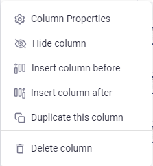

Change the columnID to the specific four
character language code that applies to the text in the column,
make sure that the capitalization is correctly entered. The two
country letters should be capitalized:

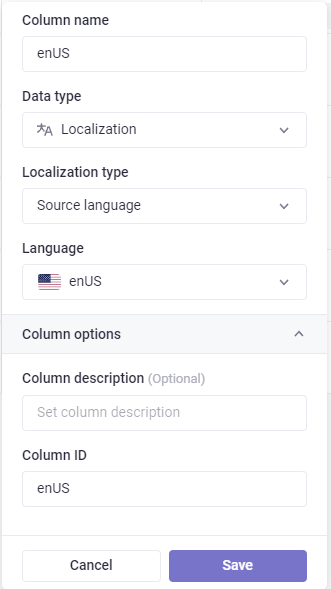

### 3. Connect Unity to Gridly
### 3.1 Plugin install steps
- Download the code from GitHub
- Unzip the package
- Copy the Gridly folder into your project assets folder

### 3.2 Setup in Unity
First you need to open the Gridly settings window by going to:
**Tools**->**Gridly**->**Setup Setting**  

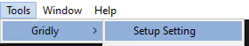

Here you have to enter your API key and define the folder in which to store the screenshots that are generated.   

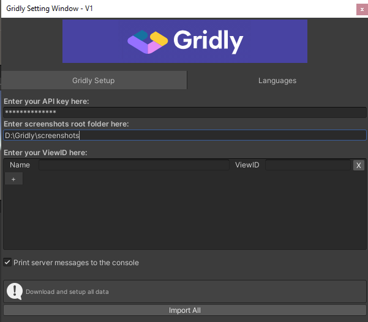

You can find your API key in Gridly in the API quick start menu in the right pane:

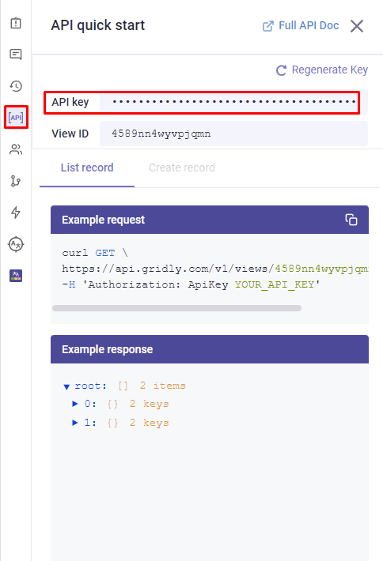

By default the plugin adds two views, but those are dummies, so feel free to delete or change their name and viewID.  
You can add a new view by clicking on the plus icon

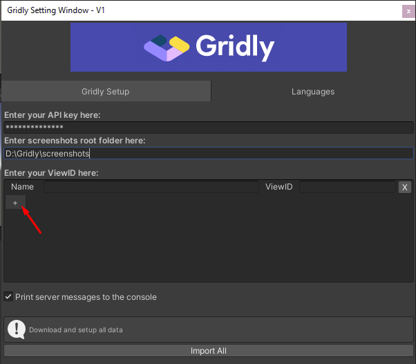

### 3.3 Maintain languages in the plugin
* You can add a language by selecting a language from the list and clicking on the "Add" button. Adding a language to your project will then create a column for this language in Gridly

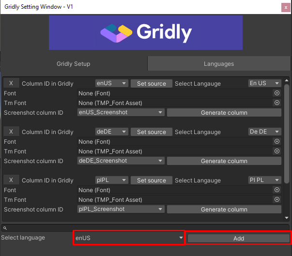

* You can remove the language by clicking on the "X" button. On deleting a language, you will see two dialogs. The first will ask you whether you want to remove the language from Unity, and the second will ask you about deleting the language and the screenshot column related to this language in Gridly.

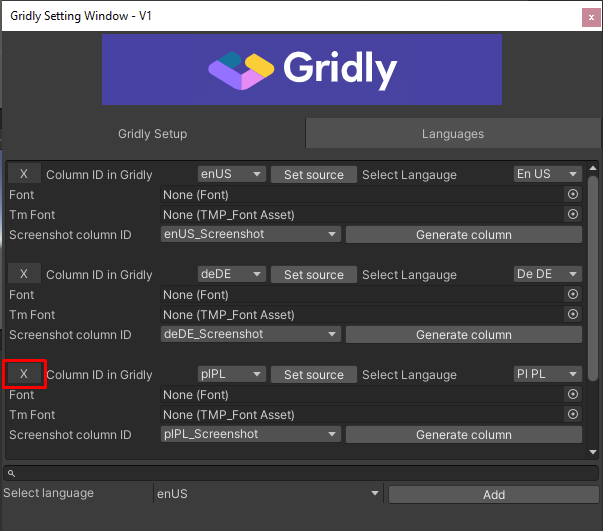

* You can select what type of font you would like to use by setting the "Font" or the "TmFont". TmFont is the Text Mesh Pro font.
* You can select the column for storing images of the given language by clicking on the dropdown menu next to the "Screenshot column ID". If you don't have any, you can create one by clicking on the "Generate column" button, which creates a "files" type column in Gridly. Then select this column ID from the list. 

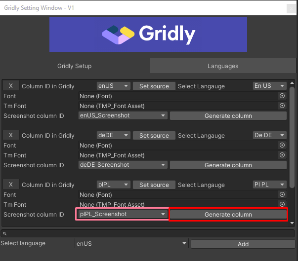

  

* You can change your project source language by clicking on the "Set source" button.
* You can change the column ID of the language by clicking on the dropdown list next to the label "Column ID in Gridly"
* You can change the language code of the given language by clicking on the "Select language" dropdown list.

### 4. String editing
### 4.1 String editor window
Select **Tool**->**Gridly**->**String Editor** to open the string editor window

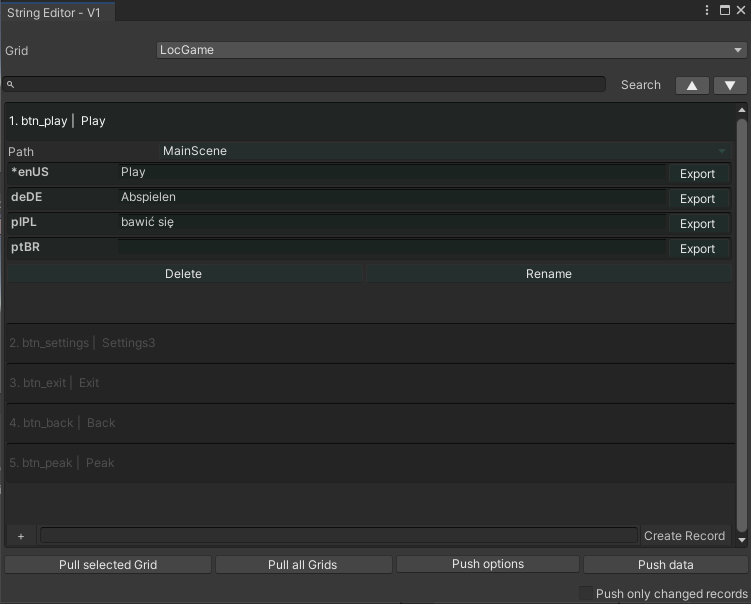

  
**Path** : You can select the scene where the string is located. This needs to be set if you want to upload screenshots for that scene  
**Delete** : Delete the record in Gridly and Unity  
**Rename** : Rename the key in Gridly and Unity  
**Create Record** : In its textbox you must specify the string ID, then hit the "Create Record" button to add it to the list  
**Pull selected grid** : Download all data from the selected Grid  
**Pull all grids** : Download all data from ALL Grids set up in the settings  
**Push options** : You can select what data you would like to upload when pushing data to Gridly  

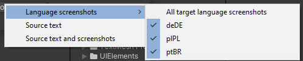

    

> **Source text** : Push only source strings into Gridly  
**Source text and screenshots**: Push source strings and related source screenshots into Gridly  
**Language screenshots** : If you select any languages, it will upload the screenshot into the column selected for that language

**Push only changed records** : Selecting this checkbox will only push strings that have been changed locally in Unity

### 4.2 Sync data at runtime
This feature makes it possible to get data from Gridly without having to rebuild the game
You can use this component to get data.  

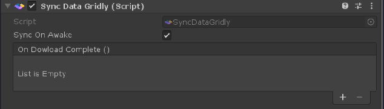

    
**Note** : Retrieving data from Gridly should be performed in a development/staging environment. Updating live/public objects is not recommended.

### 4.3 Translate text
+ Use the following **void** to set your target language  

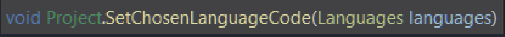

  

+ Use the following **void** to get your text  

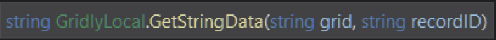

    

+ Use this component to translate UI text  

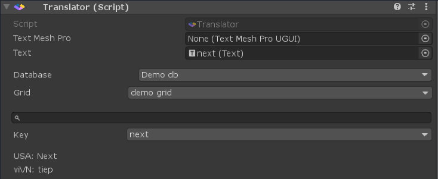

    

### 5. Example screenshot generator
### 5.1 Setup script
The ScreenshotTaker scene inside Gridly/ScreenshotSceneUtility features a script where you can define the languages you want to use during the screenshot creation and the number of seconds to wait between a scene change.  

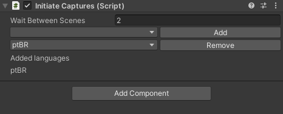

    

> You can add a language by selecting a language from the dropdown list and clicking on the "Add" button. You can remove a language by selecting it and clicking on "Remove". The languages added can be found in the "Added languages" list.

During the screenshot generation, all the scenes added to the "Scenes in Build" list will be used. You can add your scenes by going to **File**->**Build settings**  

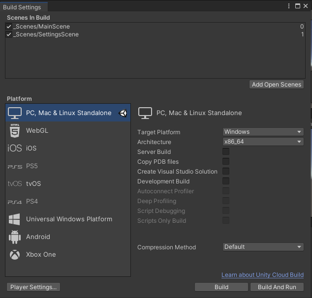

    

The screenshots will be saved to the path defined in the Gridly setup menu. The script creates subfolders for each language.
You can start the screenshot generation process by starting the scene with the play button.  

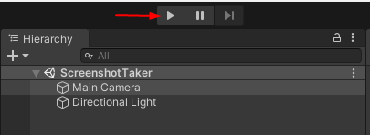

    
